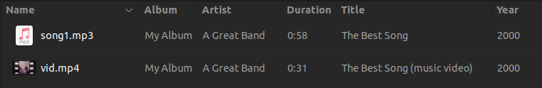

# Nautilus media metadata columns

This Python script uses the [nautilus-python](https://gitlab.gnome.org/GNOME/nautilus-python) extension and the [tinytag](https://github.com/tinytag/tinytag) audio metadata library to add media metadata columns to the Nautilus file manager.

 

## Added columns

- Artist
- Title
- Album
- Duration

## Usage

Add the `media_columns.py` script to the `$XDG_DATA_HOME/nautilus-python/extensions` directory (i.e. `~/.local/share/…`) and then restart Nautilus. 
 

